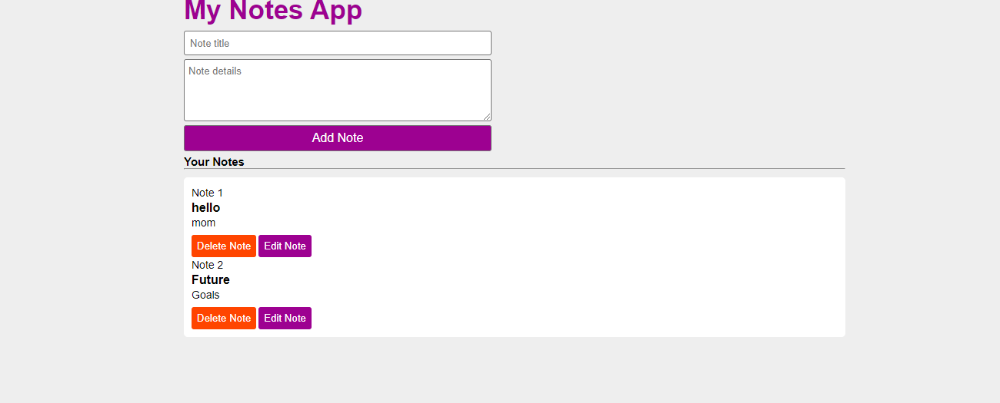

# Note App

## Features:
* It is a note app user can note anything with the title and text.

* After giving title and text user click on the add button it adds below.

* User can delete and edit the note what he wrote before.

### HTML :
* Created a input box for user to add title.

* Created a textarea for user to add text.

* Created Add Note button to add the note.

* Created a container to store all the data which is written by the user.

* After adding the text along with that assigned Delete and Edit buttons for the users flexibility to clear and re-edit the note.

### CSS:

* For the input box, text area and buttons applied styling properties.

* Added css properties for the elements which are present in html and for the container note adds is visible for the user.

### Javascript :

### Event Handling :

* When the "Add Note" button is clicked, the function checks if both the title and text fields are filled out. If not, it alerts the user to add both.

* It retrieves the current notes stored in localStorage. If notes is null, it initializes an empty array notesObj.

* Creates a new note object with the title and text entered by the user.

* Pushes the new note object into notesObj.

* Stores the updated notesObj back into localStorage as a JSON string.

* Clears the input fields (addTitle and addTxt).

* Calls showNotes method to update the displayed notes.

### Creating function to show the notes 

* Retrieves the notes from localStorage and parses them into notesObj.

* Constructs HTML  for each note in notesObj.

* Updates the innerHTML of the notes element with the generated HTML or a message if no notes exist.

### Creating Delete notes function 

* Confirms with the user before deleting a note.

* Retrieves notes from localStorage and parses into notesObj.

* Removes the note at the specified index from notesObj.

* Updates localStorage with the modified notesObj.
Calls showNotes function to update the displayed notes.

### Creating Edit notes function

* Checks if there are unsaved changes in the form    (addTitle or addTxt are not empty). If so, it alerts the user to clear the form before editing.

* Retrieves notes from localStorage and parses into notesObj.

* Finds the note at the specified index in notesObj and populates the form fields (addTitle and addTxt) with its current values.

* Removes the note from notesObj after editing.

* Updates localStorage with the modified notesObj.

* Calls showNotes function to update the displayed notes.

  
